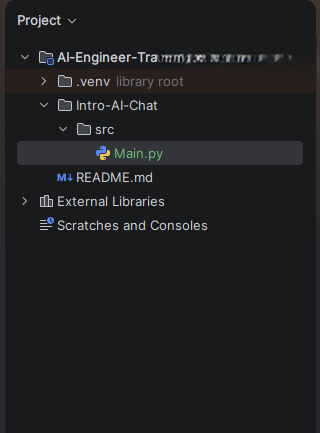
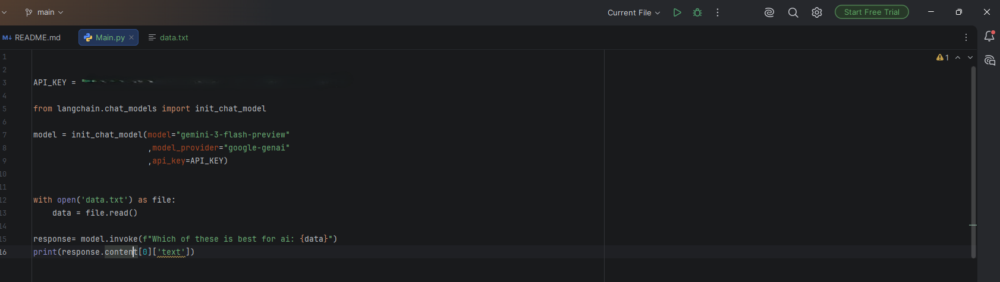
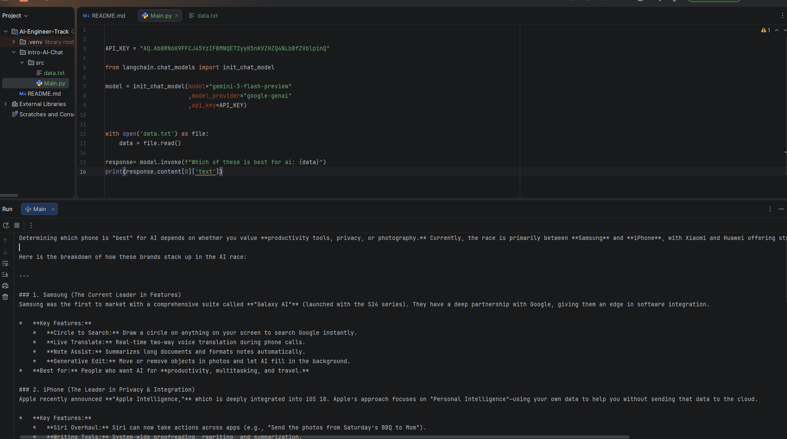

# Intro to AI Chat with LangChain & Google Gemini

My first AI Engineering project using **Python**, **LangChain**, and **Google Gemini**. This application reads data from a text file, sends it to Gemini AI, and displays an intelligent response.

## Features

- Connects to Google Gemini AI
- Uses LangChain to interact with an LLM
- Reads prompts from a text file
- Generates AI responses
- Simple and beginner-friendly

---

## Technologies

- Python 3
- LangChain
- Google Gemini 3 Flash Preview
- PyCharm

---

## Project Structure

```
Intro-AI-Chat/
│── src/
│   ├── Main.py
│   └── data.txt
│── README.md
```

---

## Code

```python
from langchain.chat_models import init_chat_model

API_KEY = "YOUR_API_KEY"

model = init_chat_model(
    model="gemini-3-flash-preview",
    model_provider="google-genai",
    api_key=API_KEY
)

with open("data.txt") as file:
    data = file.read()

response = model.invoke(f"Which of these is best for AI: {data}")

print(response.content[0]["text"])
```

> **Note:** Never upload your API key to GitHub. Store it in a `.env` file instead.

---

# Screenshots

## Project Structure

Shows the project folders and files.



---

## Source Code

Reading a text file and sending it to Google Gemini.



---

## AI Response

Gemini analyzes the file and returns an AI-generated answer.



---

## Run the Project

```bash
pip install langchain
pip install langchain-google-genai

python Main.py
```

---

## What I Learned

- Working with Large Language Models (LLMs)
- Using LangChain
- Connecting to Google Gemini
- Reading data from files
- Prompt Engineering basics

---

## Author

**Sibulelo Zondi**

I'm documenting my AI Engineering journey by building projects from beginner to advanced, with the goal of becoming a remote AI Engineer, Innovation lead, AI Software developer and eventually building my own AI company.
